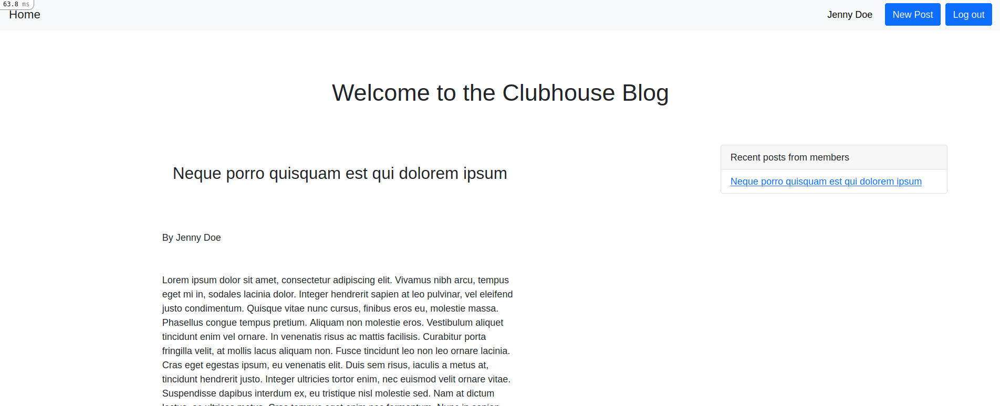

# Clubhouse Blog

> A simple blog where only members can write posts and see the authors of other posts.

## Built With

- Ruby v3.0.0
- Ruby on Rails v6.1.3
- Devise gem

## Live Demo

[Deployed app](https://infinite-gorge-45333.herokuapp.com/)

## Getting Started

To get a local copy up and running follow these simple example steps.

### Prerequisites

- Ruby on Rails v6.x. To learn how to install Ruby on Rails, please follow this [link](https://guides.rubyonrails.org/getting_started.html)

### Setup and Install

- Clone this repository using the link above (click on the 'code' button)
- open a terminal and `cd` to the cloned repository
- run `bundle install` to install the dependencies
- run `bin/rails db:migrate` to migrate the database
- start a server with `rails s`

### Usage

- Sign up to create a post

### Deployment

- Deployed in Heroku

## Authors

👤 **George Gbenle**

- GitHub: [george-shammar](https://github.com/george-shammar)
- Twitter: [@GeorgeShammar](https://twitter.com/GeorgeShammar)
- LinkedIn: [George Gbenle](https://www.linkedin.com/in/georgegbenle/)

👤 **Alicia Rojas**

- GitHub: [@aliciapaz](https://github.com/aliciapaz)
- Twitter: [@_alicia_paz](https://twitter.com/_alicia_paz)
- LinkedIn: [Alicia Rojas](https://www.linkedin.com/in/aliciapazrojas/)

## 🤝 Contributing

Contributions, issues, and feature requests are welcome!

Feel free to check the [issues page](https://github.com/aliciapaz/members-only-clubhouse/issues).

## Show your support

Give a ⭐️ if you like this project!

## Acknowledgments

- [The Odin Project](https://www.theodinproject.com/courses/ruby-on-rails/lessons/authentication)
- [Devise gem](https://github.com/heartcombo/devise)
- Webcrunch tutorial: [Building a Twitter clone](https://github.com/justalever/devise_sign_in_with_twitter)

## 📝 License

This project is [MIT](LICENSE) licensed.